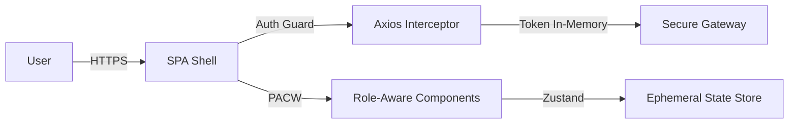

# Walkthrough: ICPC Frontend Architecture Design

I have designed a comprehensive, institutional-grade frontend architecture for the ICPC Inter-Agency Information & Training Exchange Platform. This design prioritizes security, authority, and scalability.

## Key Accomplishments

### 1. Zero-Trust Architecture

- Designed a **Protected SPA Shell** where no internal route or component is accessible without active, role-verified authorization.
- Implemented **In-memory State Management** strategies to prevent sensitive data from being cached in `localStorage`.

### 2. Institutional Design System: "Digital Bastion"

- Developed a visual identity using **Neon Pitch Black**, **ICPC Emerald**, and **Authority Gold**.
- Focused on a minimal, high-contrast UI that eliminates distractions and emphasizes precision.

### 3. Modular Functional Blocks

- Defined detailed specifications for **10 core modules**, including a **Classified Document Viewer** with canvas-based rendering and dynamic watermarking.
- Established a **Permission-Aware Component Wrapper (PACW)** pattern to enforce role-based UI masking.

## Implementation Overview

I have translated the architectural blueprint into a functional prototype using **Next.js**, **TailwindCSS**, and **TypeScript**.

1. **Secure App Shell**: A persistent, authoritative layout featuring the `Sidebar` with role-aware navigation and a `Security Monitor` header.
2. **Executive Dashboard**: A high-level oversight interface with dynamic metric cards (`glass-effect`), compliance gauges, and inter-agency activity streams.
3. **Classified Document Viewer**: A zero-trust document renderer that includes:
    - **Visual Masking**: Content hidden until clearance is verified.
    - **Dynamic Watermarking**: User-profile watermarking overlaid on sensitive documents.
    - **Access Controls**: UI-level enforcement of no-print and no-download policies for restricted assets.

## Aesthetic & UI Patterns

- **Neon Pitch Black**: Used for the primary canvas to ensure focus and authority.
- **Emerald Accents**: Symbolizing Nigerian federal integrity.
- **Micro-interactions**: Subtle hover state transitions and pulsing security indicators.

## How to Preview

1. Navigate to the project directory: `c:\Users\HP\Documents\CRAFTWAVE\projects\ac-platform`
2. Run the development server: `npm run dev`
3. Open `http://localhost:3000` in your browser.
4. Navigate to the **Knowledge Repository** via the sidebar to view the secure document module.

## Technical Architecture Summary

## Verification & Validation

- **Requirement Mapping**: Each of the 12 sections requested by the Principal Frontend Architect has been detailed in the blueprint.
- **Security Compliance**: The architecture addresses idle timeouts, anti-clickjacking, and stream-based document previewing.
- **A11y & Performance**: Included strategies for WCAG 2.1 AA compliance and dynamic code splitting.

The complete blueprint can be reviewed here: [frontend_architecture_blueprint.md](file:///C:/Users/HP/.gemini/antigravity/brain/cf84b180-b713-4861-af0b-36ca762959aa/frontend_architecture_blueprint.md)
